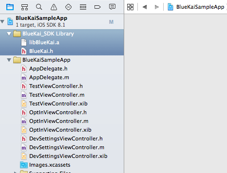
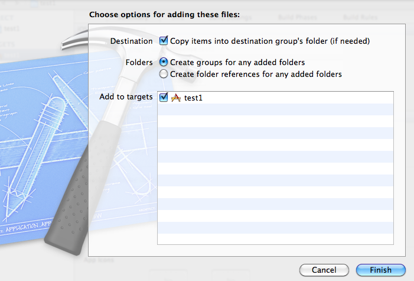
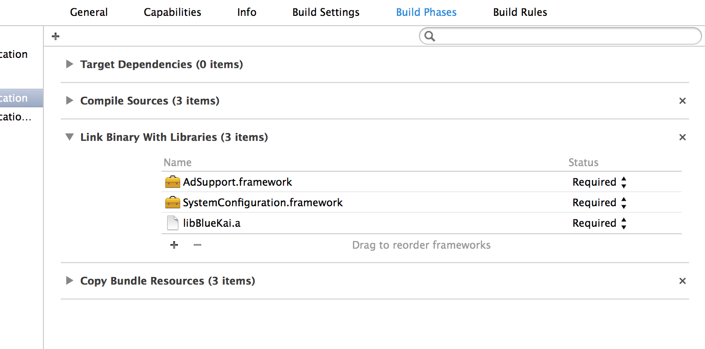
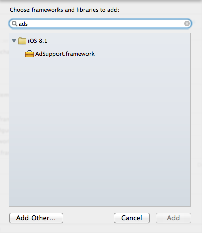
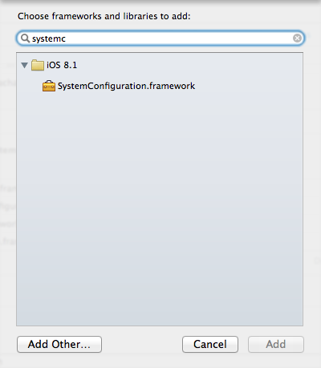

## Integrating the BlueKai SDK
### Download the BlueKai SDK for iOS

[ARC-enabled with 64-bit support] (https://github.com/BlueKai/bluekai-ios-sdk/raw/master/lib/bluekai-ios-static-ARC-v2.0.1.zip) 

[ARC-disabled with 64-bit support, if you need Manual Garbage Collection] (https://github.com/BlueKai/bluekai-ios-sdk/raw/master/lib/bluekai-ios-static-nonARC-v2.0.1.zip)

### iOS 9+ ATS Compatibility
For iOS 9 ATS compatibility, if you would like to send only HTTPS requests, please set `[blueKaiSDK setUseHttps:YES];` 

After that you will have to add exceptions to your Info.plist file as follows as we do not yet support Forward Secrecy:

```xml
<key>NSAppTransportSecurity</key>
    <dict>
        <key>NSExceptionDomains</key>
        <dict>
            <key>bluekai.com</key>
            <dict>
                <key>NSExceptionRequiresForwardSecrecy</key>
                <false/>
                <key>NSIncludesSubdomains</key>
                <true/>
            </dict>
            <key>bkrtx.com</key>
            <dict>
                <key>NSExceptionRequiresForwardSecrecy</key>
                <false/>
                <key>NSIncludesSubdomains</key>
                <true/>
            </dict>
        </dict>
    </dict>
```


### Obtain BlueKai site ID

For any demo projects a site id of `2` can be used.

But before you ship, be sure to contact your BlueKai account manager for your company site ID.

### Add BlueKai SDK to Project

In XCode, drag the "BlueKai_SDK Library" folder into the project directory as shown. 

   

When you do so you will get a prompt like the one below. Choose the
option shown in the screen. This is a suggested mechanism and you can
choose the option that fits your environment.

   

### Add Dependencies 

Add `AdSupport.framework`, `SystemConfiguration.framework` to your
project. To do so, please follow these steps. 

**NOTICE** `AdSupport.framework` is only required if you need to support Apple IDFA.

+ Go to your project properties

    
+ Select "Build Phases"
+ Click on "+" symbol in "Link Binary With Libraries" panel
+ Type "AdSupp" in the search box
+ Select "`AdSupport.framework`" from the list
+ Click on the "Add" button
    
    
+ Repeat this process to add SystemConfiguration.framework. Type "System" in the search box
+ Select "SystemConfiguration.framework" from the list
+ Click on the "Add" button
    
    

### Include BlueKai iOS SDK 

In `ViewController.h` file or the header file of your view, add 

```objective-c
@class BlueKai;
```

On the top of the corresponding implementaton `.m` file, add

```objective-c
#import "BlueKai.h"
```

### Create Instance 

In `ViewController.h` file, define an instance of BlueKai SDK.

```objective-c
@interface ViewController : UIViewController
{
    BlueKai *blueKaiSdk;
}
```

### Initialize SDK 

With the introduction of v2.0.0, there are now two main ways to initialize the SDK:

#### 1. Using UIWebView - RECOMMENDED
In `viewDidLoad` method of `ViewController.m` file, initialize the
instance of the SDK by adding these lines. Set the view controller as
the delegate for BlueKai SDK. All the arguments are required.

```objective-c
blueKaiSDK = [[BlueKai alloc] initAutoIdfaEnabledWithSiteId:@"2" withAppVersion:@"1.0" withView:self withDevMode:YES];

```
or 
```objective-c
blueKaiSDK = [[BlueKai alloc] initWithSiteId:@"2" withAppVersion:version withIdfa:idfa withView:self withDevMode:YES];
```
if you would like to provide the Apple IDFA.

The (`initWithSiteId`) argument is the site id, which you would get from BlueKai. For any demo projects a site id of 2 can be used.

The argument (`withAppVersion`) is the app version and is not necessarily the
application version of the calling application. This is a value by
which BlueKai can uniquely indentify the application from which the
request originated. A suggested approach is to use "app name-version_number" format.

The (`withView`) argument is a view to which the SDK can attach an invisible WebView to call BlueKai's tag. When
`devMode` is enabled, this view becomes visible to display values being passed to BlueKai's server for debugging.

The (`withIdfa`) argument is the Apple IDFA of the device, which provides a way of unique identification. The host app must provide this value. If you would like the mobile SDK to obtain the IDFA automatically, we recommend using the initAutoIdfaEnabledWithSiteId initializer. When the idfa is grabbed automatically, we make sure to check if the user has disabled ad tracking, and if it is disabled we will not be able to grab the idfa. 

The argument (`withDevMode`) indicates whether you want developer mode. In this mode, a webview overlay will be displayed 
with response from the BluaKai server. You should turn this feature off in your production code.

#### 2. Using NSURLConnection (no UIWebView) - ALTERNATIVE BUT NOT RECOMMENDED
If the host application does not want to initialize a UIWebView, you can use this new initializer to establish a direct connection to Bluekai. Please contact your account manager if you would like to use this method. Similar to the first approach, you can initialize the direct connection as such:

```objective-c
blueKaiSDK = [[BlueKai alloc] initDirectAutoIdfaEnabledWithSiteId:@"2" withAppVersion:@"1.0" withDevMode:YES];
```

or 
```objective-c
blueKaiSDK = [[BlueKai alloc] initDirectWithSiteId:@"2" withAppVersion:version withIdfa:idfa withDevMode:YES];
```
if you would like to provide the Apple IDFA.

For both methods, the host app can get the IDFA by calling:

```objective-c
- (NSString *)identifierForAdvertising
{
    if([[ASIdentifierManager sharedManager] isAdvertisingTrackingEnabled])
    {
        NSUUID *IDFA = [[ASIdentifierManager sharedManager] advertisingIdentifier];
        return [IDFA UUIDString];
    }
    
    return nil;
}
```

The connection is HTTPS by default for the AutoIdfaEnabled varities of the initializers, but can be changed to HTTP by calling:

```objective-c
[blueKaiSDK setUseHttps:NO];
```

**IMPORTANT**
In order to start sending data to Bluekai, the host app also needs to make sure the opt-in preference is set to `YES`:

```objective-c
[blueKaiSDK setOptInPreference:YES];
```

To stop sending data to BlueKai:

```objective-c
[blueKaiSDK setOptInPreference:NO];
```

### Passing Multiple Values

To pass multiple of key value pairs to BlueKai SDK, create an NSDictionary with key/value pairs and use the below method

    [blueKaiSdk updateWithDictionary:@{@"myKey1":@"myValue1", @"myKey2":@"myValue2"}];

### Passing a Single Value 

To pass a single key value pair to BlueKai SDK, use the below code

    [blueKaiSdk updateWithKey:@"myKey" andValue:@"myValue"];
  
### Resuming Data Post 

The `resume()` method in BlueKai SDK should be invoked from the
calling view controller’s `appCameToForeground()` method. This should be
done in order to send out any queued data, which may not have been sent
because either the application was closed while data upload was in progress or due to network issues. Create a
notification in `viewDidLoad` method or wherever you deem fit.

```objective-c
[[NSNotificationCenter defaultCenter] addObserver:self selector:@selector(appCameToForeground) name:UIApplicationWillEnterForegroundNotification object:nil];
```

Define a method appCameToForeground and call `resume()`:

```objective-c
- (void)appCameToForeground
{
   [blueKaiSdk resume];
}
```

### Add Callback Support (Optional)

Declare the BlueKai SDK delegate in `ViewController.h`. This step is
optional and is needed only if you need a callback when data is posted
to BlueKai server.


```objective-c
#import "BlueKai.h"

@interface ViewController : UIViewController <BlueKaiOnDataPostedListener>

@end
```

Set `ViewController` as the delegate. You can place this code right after initializing SDK
  
```objective-c
blueKaiSdk = [[Bluekai alloc]initWithSiteId:@"2" withAppVersion:version withView:self withDevMode:NO]; 
blueKaiSdk.delegate = (id) <BlueKaiOnDataPostedListener> self;
```

To get callbacks about the status of data posting, implement the
following delegate method in `ViewController.m`. 

```objective-c
- (void)onDataPosted:(BOOL)status {
    if (status) {
        // ... react to data being posted to BlueKai...
    }
}
```

On posting the data succesfully `status` will be `YES`. If failed, it will be `NO`.


### Send displayName by Default (Recommended)

It's recommended that the display name of the application be sent in
addition to the site id: 

```objective-c
    NSDictionary *infoPList = [[NSBundle mainBundle] infoDictionary];
    NSString *displayName = [infoPList objectForKey:@"CFBundleDisplayName"];
    [blueKaiSdk updateWithKey:@"displayName" andValue:displayName];
```

## Public Methods

### Properties

Set a delegate for callbacks; works in conjunction with the `onDataPosted` method
```objective-c
@property (nonatomic, weak) id <BlueKaiOnDataPostedListener> delegate;
```

Set developer mode (YES or NO); provides verbose logging
```objective-c
@property (nonatomic) BOOL devMode;
```

Set the calling application version number
```objective-c
@property (nonatomic) NSString *appVersion;
```

Set the ViewController instance as view to get notification on the data posting status
```objective-c
@property (nonatomic) UIViewController *viewController;
```

Set BlueKai site id
```objective-c
@property (nonatomic) NSString *siteId;
```

Use HTTPS transfer protocol
```objective-c
@property (nonatomic) BOOL useHttps;
```


### Methods

**RECOMMENDED** Create the instance for Bluekai SDK with required arguments (IDFA is grabbed automatically if user has not disabled it).
```objective-c
- (id)initAutoIdfaEnabledWithSiteId:(NSString *)siteID withAppVersion:(NSString *)version withView:(UIViewController *)view withDevMode:(BOOL)devMode;
```

Create the instance for Bluekai SDK with required arguments (provide IDFA manually).
```objective-c
- (id)initWithSiteId:(NSString *)siteId withAppVersion:(NSString *)version withIdfa:(NSString *)idfa withView:(UIViewController *)view withDevMode(BOOL)value
```

**ALTERNATIVE BUT NOT RECOMMENDED** Create the instance for Bluekai SDK with required arguments for direct connection (IDFA is grabbed automatically if user has not disabled it). Uses NSURLConnection vs. UIWebView.
```objective-c
- (id)initDirectAutoIdfaEnabledWithSiteId:(NSString *)siteID withAppVersion:(NSString *)version withDevMode:(BOOL)devMode;
```

Create the instance for Bluekai SDK with required arguments for direct connection (provide IDFA manually).
```objective-c
- (id)initDirectWithSiteId:(NSString *)siteID withAppVersion:(NSString *)version withIdfa:(NSString *)idfa withDevMode:(BOOL)devMode;
```

Method to resume BlueKai process after calling application resumes or comes to foreground. To use in onResume() of the calling activity foreground.
```objective-c
- (void)resume
```

Method to set user opt-in or opt-out preference
```objective-c
- (void) setOptInPreference:(BOOL)OptIn
```

Set key/value strings in a NSDictionary and send them to BlueKai server
```objective-c
- (void)updateWithDictionary:(NSDictionary *)dictionary
```

Set key/value strings and send them to BlueKai server
```objective-c
- (void)updateWithKey:(NSString *)key andValue:(NSString *)value
```

Allows your app to receive a callback from the BlueKai SDK when data has been posted to servers
```objective-c
- (void)onDataPosted:(BOOL)status;
```

### Deprecated Methods

**[DEPRECATED]**
Init a BlueKai object
```objective-c
- (id)initWithArgs:(BOOL)value withSiteId:(NSString *)siteID withAppVersion:(NSString *)version withView:(UIViewController *)view
```

**[DEPRECATED]**
Method to show BlueKai in-built opt-in or opt-out screen
```objective-c
- (void)showSettingsScreen
```

**[DEPRECATED]**
The same functionality as `showSettingsScreen` with ability to set custom background color
```objective-c
- (void)showSettingsScreenWithBackgroundColor:(UIColor *)color
```

**[DEPRECATED]**
Set key/value strings and send them to BlueKai server
```objective-c
- (void)put:(NSString *)key withValue:(NSString *)value
```

**[DEPRECATED]**
Set key/value strings in a NSDictionary and send them to BlueKai server
```objective-c
- (void)put:(NSDictionary *)dictionary
```

## Updating the SDK 

Update, unless otherwise indicated, can be done by just copying over
the previous version. 
